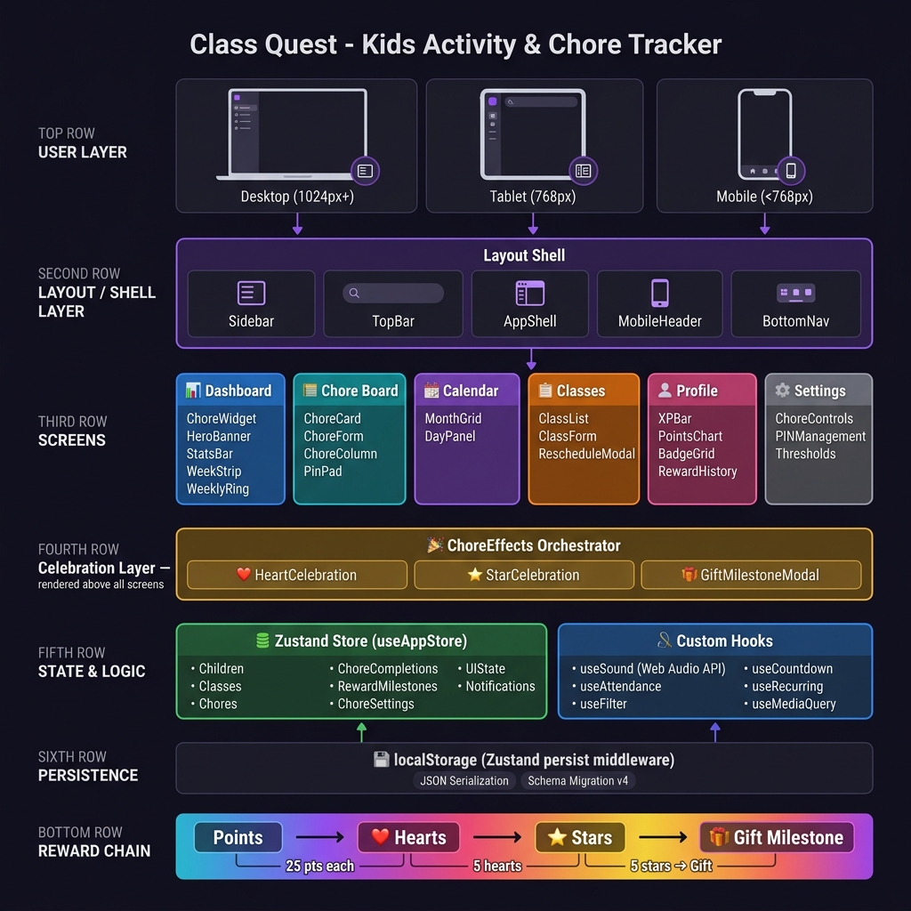

<div align="center">

# 🦁 Class Quest

### *The all-in-one kids activity & chore tracker that makes parenting fun*

[](https://react.dev)
[](https://www.typescriptlang.org)
[](https://vitejs.dev)
[](https://zustand-demo.pmnd.rs)
[](LICENSE)

**Track classes · Assign chores · Earn rewards · Level up together**

[✨ Features](#-features) · [🚀 Getting Started](#-getting-started) · [📸 Screenshots](#-screenshots) · [🏗 Architecture](#-architecture) · [🎮 Reward System](#-reward-system)

</div>

---

## 🌟 What is Class Quest?

Class Quest is a **desktop-first, fully responsive** web app designed for parents and kids. It combines a beautiful **extracurricular class tracker** with a motivating **chore & rewards system** — all in one place.

Kids earn **Points → Hearts → Stars → Gifts** as they complete chores, while parents stay on top of swimming lessons, piano classes, soccer practice and more. Leo the Lion 🦁 (our mascot) cheers them on every step of the way.

> 💡 **Everything runs in your browser.** No account needed, no data sent to any server — 100% local storage.

---

## ✨ Features

### 🗂 Class Tracker
- **Add / edit / delete** classes with name, child, date, time, duration, location, category, recurring frequency, instructor, and notes
- **6 categories** with custom illustrated icons: ⚽ Sport · 🎵 Music · 🎨 Art · 📚 Academic · 💃 Dance · ⭐ Other
- **Recurring classes** — one-time, weekly, biweekly, monthly; generates all future instances in one click
- **Mark attended / missed** with one tap — earns XP for the child
- **Reschedule a class** — picks a new date/time with an optional reason; tagged visually with a 🔄 Rescheduled badge
- **Cancel** (keeps record) vs **Delete** (removes permanently) with confirmation
- **Filter & search** by child, category, date range, or status
- **Countdown chip** on each upcoming class card — turns red when < 1 hour away

### 🗓 Calendar
- Full **monthly grid** with coloured category dots per day
- **Day detail panel** slides in on desktop (right panel) / bottom sheet on mobile
- Navigate months, click any day to see its classes

### 📊 Dashboard
- **Hero banner** with motivational greeting, today's class count, and mascot
- **4-stat chips** — Total · Upcoming · Completed · Missed
- **3-column desktop grid** — Today's classes | Weekly ring + challenge | Child XP & leaderboard
- **Week strip** — tap any day to filter today's view
- **Chore Widget** — daily chore checklist with quick-complete right from the dashboard
- **Recent Activity feed** — everything that happened today

### 🗂 Chore Board
- **2-column layout** — Positive Chores (green) | Behaviours (red)
- Each chore has a name, description, emoji icon, point value, category, recurrence, and assigned child
- **Positive chores** reward points: "Made the bed" +5 · "Did homework" +10 · "Helped with dinner" +8
- **Negative records** deduct points: "Left room messy" -3 · "Rude to sibling" -5
- **Recurring chores** — Daily · Weekdays only · Weekly · One-time — auto-reset each cycle
- **Animated +/- floating indicator** on every chore completion
- **Undo** a same-day completion without losing permanent hearts/stars
- **Reset Today** button to wipe the day's completions cleanly
- **Parent PIN gate** — optional 4-digit PIN confirmation before marking chores done

### 🎮 Gamification & XP
- **XP bar** per child — levels up as they attend classes (50 XP per class)
- **Achievement badges**: 🌟 First Class · 🔥 On Fire · ⚽ Soccer Star · 🎨 Artist · 📚 Scholar · ✅ Perfect Week · 🐦 Early Bird · 🏆 Champion
- **Streak counter** — consecutive classes attended
- **Weekly Challenge** card on dashboard
- **Leaderboard** across all kids in the family

### 🏆 Reward Chain
```
Chore Done → Points → ❤️ Hearts → ⭐ Stars → 🎁 Gift Milestone
```
- Customise every threshold in Settings
- Full-screen **celebration overlays** on each milestone:
  - ❤️ Rising hearts animation
  - ⭐ Starburst + dancing mascot
  - 🎁 Undismissable gift popup with 3-step parent flow (main → PIN → gift note)
- **"Remind me later"** snooze on the gift popup (re-appears after 1 hour)

### 👦👧 Child Profiles
- Emoji avatar + colour theme per child
- XP bar, level, streak, attendance rate, badge trophy shelf
- **Class Passport Stamps** — one stamp per category attended
- **Chore Rewards section** — progress bar to next heart, hearts/stars progress grid
- **30-day SVG points chart** — green earned / red deducted bars
- **Mood check-in log** — 5 moods tracked per class visit
- **Gift reward history** — every milestone with parent's gift note

### ⚙️ Settings
- 🌙 Dark Mode / ☀️ Light Mode toggle
- 🎵 Sound effects on/off (Web Audio API — no files, 100% synthesized)
- 🗂 Chore Controls:
  - Kids can mark their own chores (toggle)
  - Celebration animations on/off
  - Points per ❤️, Hearts per ⭐, Stars per 🎁 (all adjustable)
  - Parent PIN — set / change / clear
  - Family Weekly Chore Report inline
- 📥 Export all data as JSON backup
- 🔄 Reset All Data (with confirmation)

### 📱 Fully Responsive Layout
| Breakpoint | Layout |
|---|---|
| **≥ 1024px** (Desktop) | Fixed 240px sidebar · TopBar with search + notification bell · 3-column dashboard |
| **768–1023px** (Tablet) | Collapsed 64px icon-only sidebar · content fills remaining width |
| **< 768px** (Mobile) | No sidebar · sticky mobile header · bottom tab bar · stacked layouts |

---

## 🚀 Getting Started

### Prerequisites
- **Node.js** 18+ and **npm** 9+

### Installation

```bash
# 1. Clone the repo
git clone https://github.com/PriyankaSDaida/kids-class-chore-tracker.git
cd kids-class-chore-tracker

# 2. Install dependencies
npm install

# 3. Start the dev server
npm run dev
```

Open **http://localhost:5173** in your browser. The onboarding wizard will walk you through adding your first child. 🎉

### Build for Production

```bash
npm run build        # Outputs to /dist
npm run preview      # Preview the production build locally
```

---

## 🏗 Architecture

<div align="center">



</div>

```
src/
├── components/
│   ├── calendar/        # CalendarView — month grid + day panel
│   ├── children/        # ChildrenList — add/edit/delete kids
│   ├── chores/          # ChoreBoard, ChoreCard, ChoreForm, ChoreWidget
│   │                    # PinPad, FloatingPoint, PointsChart
│   │                    # HeartCelebration, StarCelebration, GiftMilestoneModal
│   │                    # ChoreEffects (global celebration orchestrator)
│   ├── classes/         # ClassList, ClassForm, RescheduleModal, AttendanceLog
│   ├── costs/           # CostSummary — monthly cost tracker
│   ├── dashboard/       # Dashboard, HeroBanner, StatsBar, WeekStrip, WeeklyRing
│   │                    # ClassCard, RecentActivity, MoodCheckIn
│   ├── gamification/    # XPBar, BadgeGrid, BadgeCelebration, WeeklyChallenge
│   │                    # Leaderboard, StreakFlame, ConfettiEffect
│   ├── layout/          # AppShell, Sidebar, TopBar, MobileHeader, BottomNav
│   ├── onboarding/      # Multi-step onboarding wizard
│   ├── profile/         # ChildProfile — full rewards + stats page
│   ├── settings/        # Settings with chore controls + parent PIN
│   └── ui/              # Avatar, Badge, Mascot, Toast, Modal, EmptyState, ConfirmDialog
├── hooks/
│   ├── useAppStore.ts   # (re-export)
│   ├── useAttendance.ts # Streak + attendance % calculations
│   ├── useCountdown.ts  # Live countdown to next class
│   ├── useFilter.ts     # Class filter/search logic
│   ├── useMediaQuery.ts # Responsive breakpoint hooks
│   ├── useNotifications.ts
│   ├── useRecurring.ts  # Recurring class generation
│   └── useSound.ts      # Web Audio API sound engine
├── store/
│   ├── types.ts         # All TypeScript types + constants
│   └── useAppStore.ts   # Zustand store with persist middleware
├── styles/
│   ├── index.css        # CSS variables, tokens, global resets
│   ├── components.css   # All component styles (BEM-ish, no Tailwind)
│   └── animations.css   # Keyframe animations
└── utils/
    ├── dateUtils.ts
    └── colorUtils.ts
```

### Tech Stack

| Layer | Choice | Why |
|---|---|---|
| **Framework** | React 18 | Component model, concurrent features |
| **Language** | TypeScript 5 | Type safety across the whole codebase |
| **Build tool** | Vite 5 | Sub-second HMR, fast production builds |
| **State** | Zustand + `persist` | Zero boilerplate, persisted to localStorage |
| **Styling** | Vanilla CSS | Full control, no runtime overhead, dark mode via `data-theme` |
| **Icons** | Lucide React | Consistent, tree-shakeable SVG icons |
| **Dates** | date-fns | Lightweight, tree-shakeable date utilities |
| **Sound** | Web Audio API | No external files — all sounds synthesized in-browser |
| **Charts** | Pure SVG | No chart library dependency — hand-drawn 30-day bar chart |

---

## 🎮 Reward System

The chore reward chain is fully configurable in **Settings → Chore Controls**:

```
Points  ──(25 default)──►  ❤️ Heart
Heart   ──(5 default)───►  ⭐ Star
Star    ──(5 default)───►  🎁 Gift Milestone
```

### Gift Milestone Flow
1. **Star count hits threshold** → undismissable 🎁 Gift popup appears
2. Parent can **"Remind me later"** → snoozes 1 hour, re-appears automatically
3. Parent taps **"Claim Gift"** → optional PIN → adds a gift note ("Trip to the movies! 🎬")
4. Gift is marked claimed and saved to the child's **Reward History** on their profile

### Negative Points
- Points can go below 0 (e.g. for behaviour records)
- Hearts and Stars earned are **permanent** — undoing a chore only reverses raw points
- Kids earn their way back by doing positive chores

---

## 🎨 Design System

- **Font**: [Nunito](https://fonts.google.com/specimen/Nunito) (headings/UI) + [Inter](https://fonts.google.com/specimen/Inter) (body)
- **Colour palette**: Vivid violet accent (`#7C3AED`) with semantic green/red/amber/pink
- **Border radii**: `--r-sm` → `--r-2xl` design tokens
- **Shadows**: 4-level shadow system (`--shadow-sm` → `--shadow-xl`)
- **Animations**: Spring-physics easing, confetti, floating particles, mascot dance
- **Dark mode**: Automatic via `data-theme="dark"` on `<html>` — all colors swap via CSS variables, no class toggling

---

## 🔒 Privacy

All data is stored **only in your browser** using `localStorage`. Nothing is sent to any server. Use **Settings → Export Data** to download a JSON backup at any time. Use **Settings → Reset All Data** to start fresh.

---

## 🤝 Contributing

Pull requests are welcome! For major changes please open an issue first.

```bash
# Fork & clone, then:
npm install
npm run dev

# Type-check before committing:
npx tsc --noEmit
```

---

## 📄 License

[MIT](LICENSE) — free to use, modify, and distribute.

---

<div align="center">

Made with ❤️ for kids and the parents who cheer them on

**🦁 Leo says: "Keep going — you've got this!"**

</div>
